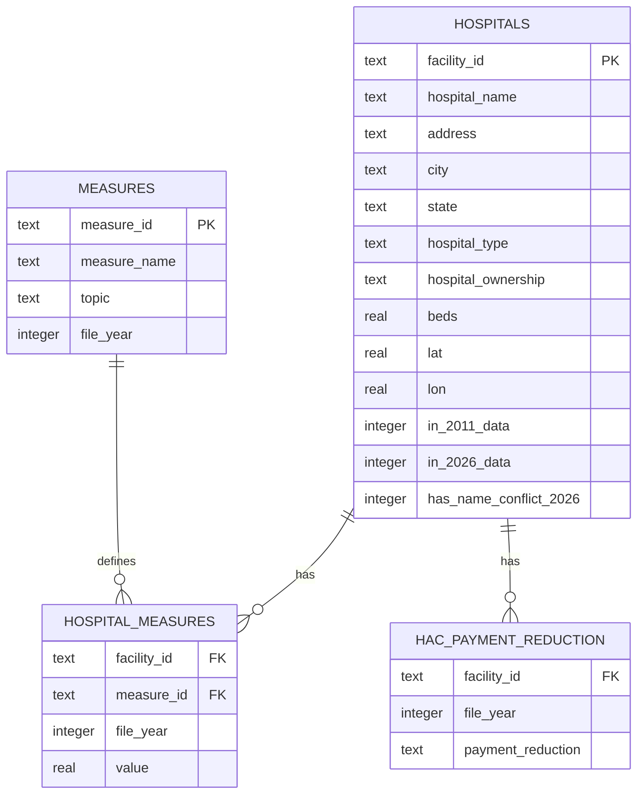

# Hospital Compare: Cleaning and Analyzing 8 Real CMS Health Files

This is a full ETL and SQL project. I took 8 raw, messy government health files from two different years (2011 and 2026), cleaned them up, matched them together, and built one unified database. Then I wrote SQL queries that show CTEs, window functions, self joins across years, and joins across different topics.

**Source data:** [CMS Hospital Compare / Care Compare](https://data.cms.gov/provider-data/topics/hospitals), official U.S. government data on about 5,400 hospitals that take Medicare. It covers death rates, infections, readmissions, cost, how fast patients get care, and Medicare payment penalties.

## Why 8 files instead of just 1

Most real world data work does not hand you one clean table. It hands you a bunch of files from different systems, different years, and different naming rules, and they are all supposed to fit together but never quite do right out of the box. This project pulls together:

<table>
<colgroup>
<col style="width:8%">
<col style="width:37%">
<col style="width:55%">
</colgroup>
<thead>
<tr><th>Year</th><th>File</th><th>Topic</th></tr>
</thead>
<tbody>
<tr><td>2011</td><td><code>hospital-data.csv</code></td><td>Hospital directory (address, ownership, type)</td></tr>
<tr><td>2011</td><td><code>outcome-of-care-measures.csv</code></td><td>Heart attack, heart failure, and pneumonia deaths and readmissions</td></tr>
<tr><td>2026</td><td><code>Complications_and_Deaths-Hospital_2026.csv</code></td><td>30 day death rates (heart attack, CABG, COPD, stroke, heart failure)</td></tr>
<tr><td>2026</td><td><code>Healthcare_Associated_Infections-Hospita_2026.csv</code></td><td>Infections caught in the hospital (CLABSI, CAUTI, MRSA, C.diff, SSI)</td></tr>
<tr><td>2026</td><td><code>FY_2026_Hospital_Readmissions_Reduction_Program_Hospital.csv</code></td><td>30 day readmission rates</td></tr>
<tr><td>2026</td><td><code>Medicare_Hospital_Spending_Per_Patient-Hospital_2026.csv</code></td><td>Medicare payment per episode of care</td></tr>
<tr><td>2026</td><td><code>Timely_and_Effective_Care-Hospital_2026.csv</code></td><td>Sepsis care, ER wait times, vaccination rates</td></tr>
<tr><td>2026</td><td><code>FY_2026_HAC_Reduction_Program_Hospital.csv</code></td><td>Penalty program for hospital acquired conditions</td></tr>
</tbody>
</table>

## The mess, in plain terms

- The two years mark missing data differently. The 2011 file uses the text `"Not Available"`. The 2026 files leave the cell blank, or use `"N/A"`, or use `"Too Few to Report"`. All of these needed to turn into a real SQL `NULL`.
- CMS changed the shape of the files between 2022 and 2026. Most topic files used to be wide, one column per measure, with the hospital name and ID crammed into one cell like `"SOUTHEAST HEALTH MEDICAL CENTER (010001)"`. Now, 4 of the 6 files are already long, one row per hospital and per measure, with a clean `Facility ID` column and a `Measure ID` column already split apart. But not every file changed the same way: the readmissions file is long too but has no `Measure ID` column at all (it uses `Measure Name` as the code instead), and the HAC file is still wide. So the cleaning script needs a different rule for each of the three shapes, not one rule for all six files.
- The 2026 files also dropped some columns that used to be there. Hospital Type, Ownership, Bed Count, Latitude, and Longitude are gone from all 6 topic files. This is a real gap in what CMS publishes now, not a mistake in the cleaning. Any hospital that only shows up in the 2026 data (and not the 2011 data) simply has no bed count or ownership info, and the `hospitals` table is honest about that with `NULL`s instead of guessing.
- My first attempt at building measure IDs accidentally merged two different things into one ID. A "Denominator" column and a "Score" column both risked ending up under the same ID. I only caught it when the database load failed on a duplicate key. That is a good example of a quiet bug that only shows up once you actually try to use the data.
- Hospital IDs only partly match up between 2011 and 2026. Hospitals close, merge, and open over a 15 year gap, so I used an outer join and tagged each row with `in_2011_data` and `in_2026_data` flags.

The full list of every issue and how I fixed it is here: [`docs/data_cleaning_notes.md`](docs/data_cleaning_notes.md).

## Schema



One fact table covers all 8 source files and both years. That is really the whole point of normalizing the data this way. Every measure, from every topic and every year, lives in `hospital_measures`, keyed by `(facility_id, measure_id)`. The `measures` table then tells you which of the 6 topics and which year each measure came from. That is what turns a question like "compare 2011 and 2026 heart attack deaths for the same hospital" (query 02) or "do penalized hospitals have worse infection rates" (query 06) into a single join, instead of a custom multi table query every time.

## Project structure

```
├── data/
│   ├── raw/
│   │   ├── hospital-data.csv                  # 2011 directory
│   │   ├── outcome-of-care-measures.csv       # 2011 outcomes
│   │   └── topics/                            # 6 current (2026) topic files
│   └── clean/                                 # cleaned, tidy CSVs (also loaded into the DB)
├── scripts/
│   └── clean_and_load.py                      # the ETL: reads 8 raw files, cleans them, builds SQLite DB
├── sql/
│   ├── schema.sql                             # DDL for the normalized schema
│   ├── ERD_Schema.png                         # ERD diagram generated from PostgreSQL
│   └── queries/                               # 8 analytical queries, each documenting what it demonstrates
│
├── docs/
│   └── data_cleaning_notes.md                 # every data quality issue found, and how each was fixed
├── hospital_compare.db                        # the built SQLite database (generated by the script)
├── Query_01-08.ipynb                          # a series of SQL exercises using SQLite and Jupyter Notebook
└── README.md
```

## How to run it

```bash
pip install pandas
python3 scripts/clean_and_load.py     # rebuilds hospital_compare.db from all 8 raw files
```

Then query the database with any SQLite client, for example:

```bash
python3 -c "
import sqlite3
conn = sqlite3.connect('hospital_compare.db')
print(conn.execute(open('sql/queries/06_hac_penalty_vs_infections.sql').read()).fetchall())
"
```

The schema in `sql/schema.sql` is plain, standard SQL. I moved it to PostgreSQL with no changes other than removing the SQLite only `PRAGMA` line, just to generate the ERD diagram.

**Note on the database file:** `hospital_compare.db` is not committed to the repo, it is in `.gitignore`. You can rebuild it locally any time with the command above after cloning.

## Analytical queries

| Query | What it shows | SQL concepts |
|---|---|---|
| [`01_state_mortality_rankings_2026.sql`](sql/queries/01_state_mortality_rankings_2026.sql) | Ranks states by current heart attack death rate vs. the national average | CTE, `RANK()`, `HAVING` |
| [`02_then_vs_now_2011_2026.sql`](sql/queries/02_then_vs_now_2011_2026.sql) | Same hospital's heart attack death rate, 2011 vs 2026 | Self join across two different years, on one unified fact table |
| [`03_cross_topic_worst_quartile.sql`](sql/queries/03_cross_topic_worst_quartile.sql) | Hospitals that land in the worst quarter on both an infection measure and a death rate measure | Two independent `NTILE()` CTEs joined on facility |
| [`04_ownership_vs_outcomes.sql`](sql/queries/04_ownership_vs_outcomes.sql) | Death rates across ownership types, 4 conditions side by side (2011 ownership data only, see notes) | Conditional aggregation (pivot pattern) |
| [`05_data_completeness_by_topic.sql`](sql/queries/05_data_completeness_by_topic.sql) | Percent of missing data per topic, not just per measure | Grouped data quality audit |
| [`06_hac_penalty_vs_infections.sql`](sql/queries/06_hac_penalty_vs_infections.sql) | Do penalized hospitals really have worse infection rates? | Joining a small category table into the main fact table |
| [`07_cross_file_consistency_check.sql`](sql/queries/07_cross_file_consistency_check.sql) | Do all 6 files agree on hospital name for the same facility? | SQL version of an ETL time quality check |
| [`08_topic_coverage_by_state.sql`](sql/queries/08_topic_coverage_by_state.sql) | Which states' hospitals report the most complete data? | Two level aggregation, per hospital then per state |

## Key findings

- Penalties under the hospital acquired conditions program line up with real infection performance (query 06). This suggests the penalty program is measuring something real, not just noise.
- Death rates for hospitals that show up in both the 2011 and 2026 data (query 02) reflect both real changes in care over 15 years and a change in how CMS calculates these numbers. It does not simply mean "care got worse" or "care got better."
- CMS changed the shape of its own downloads between 2022 and 2026: most topic files went from wide (one column per measure) to already long (one row per hospital and measure). That is a good reminder that a cleaning pipeline built for one year's file shape can silently break the next time you pull fresh data, even from the exact same government source.
- CMS also quietly dropped ownership, bed count, and lat/lon from the 2026 topic files. Anyone doing "then vs now" ownership or capacity comparisons needs to lean on the 2011 directory for that, since the 2026 files can no longer supply it on their own.
- Out of 5,455 total hospitals across both years, 4,826 show up in the 2011 snapshot, 4,789 show up in the 2026 snapshot, and only 4,160 show up in both. That is a reminder that hospitals close, merge, and open, so any "then vs now" comparison is really only looking at the hospitals that survived the whole period.

## Data source and license

The data comes from CMS (Centers for Medicare and Medicaid Services), a public U.S. government agency, and the underlying data is public domain. The 2011 files are a static snapshot mirrored on GitHub by [donnemartin/hospital-quality](https://github.com/donnemartin/hospital-quality). The 2026 topic files were pulled directly from CMS's own current download page, [data.cms.gov/provider-data](https://data.cms.gov/provider-data/topics/hospitals), which is also the place to go for the most current data going forward.
