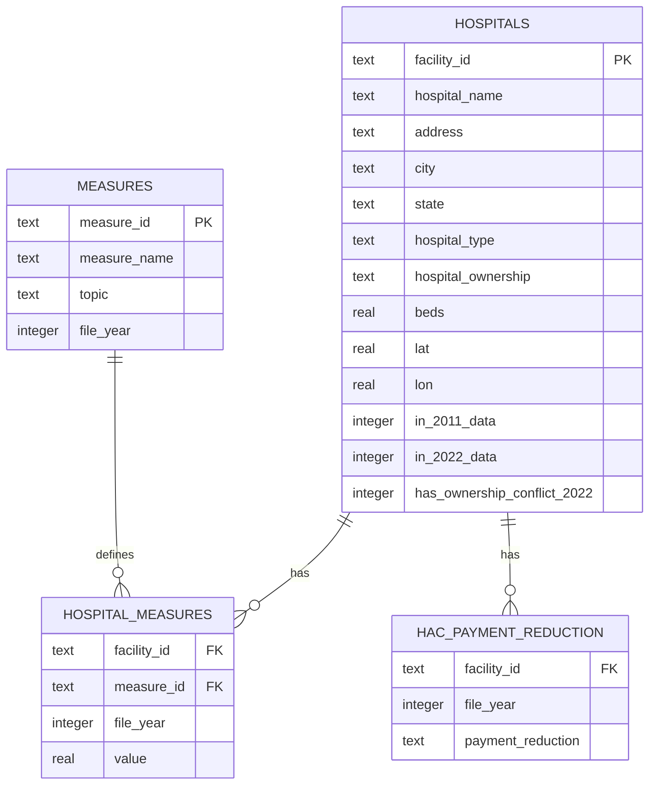

# Hospital Compare: Cleaning and Analyzing 8 Real CMS Health Files

This is a full ETL and SQL project. I took 8 raw, messy government health files from two different years (2011 and 2022), cleaned them up, matched them together, and built one unified database. Then I wrote SQL queries that show CTEs, window functions, self joins across years, and joins across different topics.

**Source data:** [CMS Hospital Compare / Care Compare](https://data.cms.gov/provider-data/topics/hospitals), official U.S. government data on about 5,200 hospitals that take Medicare. It covers death rates, infections, readmissions, cost, how fast patients get care, and Medicare payment penalties.

## Why 8 files instead of just 1

Most real world data work does not hand you one clean table. It hands you a bunch of files from different systems, different years, and different naming rules, and they are all supposed to fit together but never quite do right out of the box. This project pulls together:

| Year | File | Topic |
|---|---|---|
| 2011 | `hospital-data.csv` | Hospital directory (address, ownership, type) |
| 2011 | `outcome-of-care-measures.csv` | Heart attack, heart failure, and pneumonia deaths and readmissions |
| 2022 | `Complications_and_Deaths_2022.csv` | 30 day death rates (heart attack, CABG, COPD, stroke, heart failure) |
| 2022 | `HAIs_2022.csv` | Infections caught in the hospital (CLABSI, CAUTI, MRSA, C.diff, SSI) |
| 2022 | `Hospital_Readmissions_Reduction_Program_2022.csv` | 30 day readmission rates |
| 2022 | `Payment_and_Value_of_Care_2022.csv` | Medicare payment per episode of care |
| 2022 | `Timely_and_Effective_Care_2022.csv` | Sepsis care, ER wait times, vaccination rates |
| 2022 | `Hospital_Acquired_Conditions_Reduction_Program_2022.csv` | Penalty program for hospital acquired conditions |

## The mess, in plain terms

- The two years mark missing data differently. The 2011 file uses the text `"Not Available"`. The 2022 files just leave the cell blank. Both needed to turn into a real SQL `NULL`.
- In the 2022 files, the `Hospital` column crams the name and ID into one cell, like `"SOUTHEAST HEALTH MEDICAL CENTER (010001)"`. I had to split that apart with a regex before anything could be joined.
- All 6 of the 2022 files repeat the same basic info (ownership, bed count, location) for every hospital. Instead of just trusting that they all agree, the script actually checks for conflicts between files. See `has_ownership_conflict_2022` and query 07.
- My first attempt at building measure IDs accidentally merged two different things into one ID. A "Denominator" column and a "Payment" column both ended up named `PAYMENT_FOR_HEART_ATTACK_PATIENTS`. I only caught it when the database load failed on a duplicate key. That is a good example of a quiet bug that only shows up once you actually try to use the data.
- Hospital IDs only partly match up between 2011 and 2022. Hospitals close, merge, and open over an 11 year gap, so I used an outer join and tagged each row with `in_2011_data` and `in_2022_data` flags.

The full list of every issue and how I fixed it is here: [`docs/data_cleaning_notes.md`](docs/data_cleaning_notes.md).

## Schema



One fact table covers all 8 source files and both years. That is really the whole point of normalizing the data this way. Every measure, from every topic and every year, lives in `hospital_measures`, keyed by `(facility_id, measure_id)`. The `measures` table then tells you which of the 6 topics and which year each measure came from. That is what turns a question like "compare 2011 and 2022 heart attack deaths for the same hospital" (query 02) or "do penalized hospitals have worse infection rates" (query 06) into a single join, instead of a custom multi table query every time.

## Project structure

```
├── data/
│   ├── raw/
│   │   ├── hospital-data.csv                  # 2011 directory
│   │   ├── outcome-of-care-measures.csv       # 2011 outcomes
│   │   └── topics/                            # 6 current (2022) topic files
│   └── clean/                                 # cleaned, tidy CSVs (also loaded into the DB)
├── scripts/
│   └── clean_and_load.py                      # the ETL: reads 8 raw files, cleans them, builds SQLite DB
├── sql/
│   ├── schema.sql                             # DDL for the normalized schema
│   ├── ERD_Schema.png                         # ERD diagram generated from PostgreSQL
│   └── queries/                               # 8 analytical queries, each documenting what it demonstrates
│
├── docs/
│   └── data_cleaning_notes.md                 # all 10 data quality issues found, and how each was fixed
├── hospital_compare.db                        # the built SQLite database (generated by the script)
├── Query_01-08.ipynb                          # a series of SQL exercises using SQLite and Jupyter Notebook
└── README.md
```

## How to run it

```bash
pip install pandas
python3 scripts/clean_and_load.py     # rebuilds hospital_compare.db from all 8 raw files
```

Then query the database with any SQLite client, for example:

```bash
python3 -c "
import sqlite3
conn = sqlite3.connect('hospital_compare.db')
print(conn.execute(open('sql/queries/06_hac_penalty_vs_infections.sql').read()).fetchall())
"
```

The schema in `sql/schema.sql` is plain, standard SQL. I moved it to PostgreSQL with no changes other than removing the SQLite only `PRAGMA` line, just to generate the ERD diagram.

**Note on the database file:** `hospital_compare.db` is about 115MB (423K fact rows with combined text keys), so it is not committed to the repo, it is in `.gitignore`. You can rebuild it locally any time with the command above after cloning.

## Analytical queries

| Query | What it shows | SQL concepts |
|---|---|---|
| [`01_state_mortality_rankings_2022.sql`](sql/queries/01_state_mortality_rankings_2022.sql) | Ranks states by current heart attack death rate vs. the national average | CTE, `RANK()`, `HAVING` |
| [`02_then_vs_now_2011_2022.sql`](sql/queries/02_then_vs_now_2011_2022.sql) | Same hospital's heart attack death rate, 2011 vs 2022 | Self join across two different years, on one unified fact table |
| [`03_cross_topic_worst_quartile.sql`](sql/queries/03_cross_topic_worst_quartile.sql) | Hospitals that land in the worst quarter on both an infection measure and a death rate measure | Two independent `NTILE()` CTEs joined on facility |
| [`04_ownership_vs_outcomes.sql`](sql/queries/04_ownership_vs_outcomes.sql) | Death rates across ownership types, 4 conditions side by side | Conditional aggregation (pivot pattern) |
| [`05_data_completeness_by_topic.sql`](sql/queries/05_data_completeness_by_topic.sql) | Percent of missing data per topic, not just per measure | Grouped data quality audit |
| [`06_hac_penalty_vs_infections.sql`](sql/queries/06_hac_penalty_vs_infections.sql) | Do penalized hospitals really have worse infection rates? | Joining a small category table into the main fact table |
| [`07_cross_file_consistency_check.sql`](sql/queries/07_cross_file_consistency_check.sql) | Do all 6 files agree on hospital ownership for the same facility? | SQL version of an ETL time quality check |
| [`08_topic_coverage_by_state.sql`](sql/queries/08_topic_coverage_by_state.sql) | Which states' hospitals report the most complete data? | Two level aggregation, per hospital then per state |

## Key findings

- Penalties under the hospital acquired conditions program line up with real infection performance. Hospitals hit with a Medicare payment cut average a CLABSI infection ratio of 1.29, compared to 1.06 for hospitals that were not penalized. CAUTI and MRSA ratios are worse too (query 06). This suggests the penalty program is measuring something real, not just noise.
- Death rates mostly went up a little for hospitals that show up in both the 2011 and 2022 data (query 02), though this reflects both real changes in care over 11 years and a change in how CMS calculates these numbers. It does not simply mean "care got worse."
- Timely and Effective Care has the most missing data of any 2022 topic, 44.7% of its cells are empty. That is mostly because many of its 30 measures, like sepsis bundles and ER wait times, only apply to hospitals that offer that specific service. A flat "percent complete" number on its own would be misleading here.
- All 6 of the 2022 topic files agree with each other on hospital ownership, for every one of the more than 3,000 hospitals checked (query 07). That is a genuinely useful result even though it is a "nothing happened" finding. It means the underlying hospital data in the CMS catalog is internally consistent, which is not something you can just assume, it is worth checking.
- Out of 5,237 total hospitals across both years, only 4,826 show up in both the 2011 and 2022 snapshots. That is a reminder that hospitals close, merge, and open, so any "then vs now" comparison is really only looking at the hospitals that survived the whole period.

## Data source and license

The data comes from CMS (Centers for Medicare and Medicaid Services), a public U.S. government agency, and the underlying data is public domain. The 2011 files are a static snapshot mirrored on GitHub by [donnemartin/hospital-quality](https://github.com/donnemartin/hospital-quality). The 2022 topic files come from a historical archive of CMS's own releases, maintained by [klocey/hospitals-data-archive](https://github.com/klocey/hospitals-data-archive). For current, up to date data, pull fresh files directly from [data.cms.gov/provider-data](https://data.cms.gov/provider-data/topics/hospitals).
