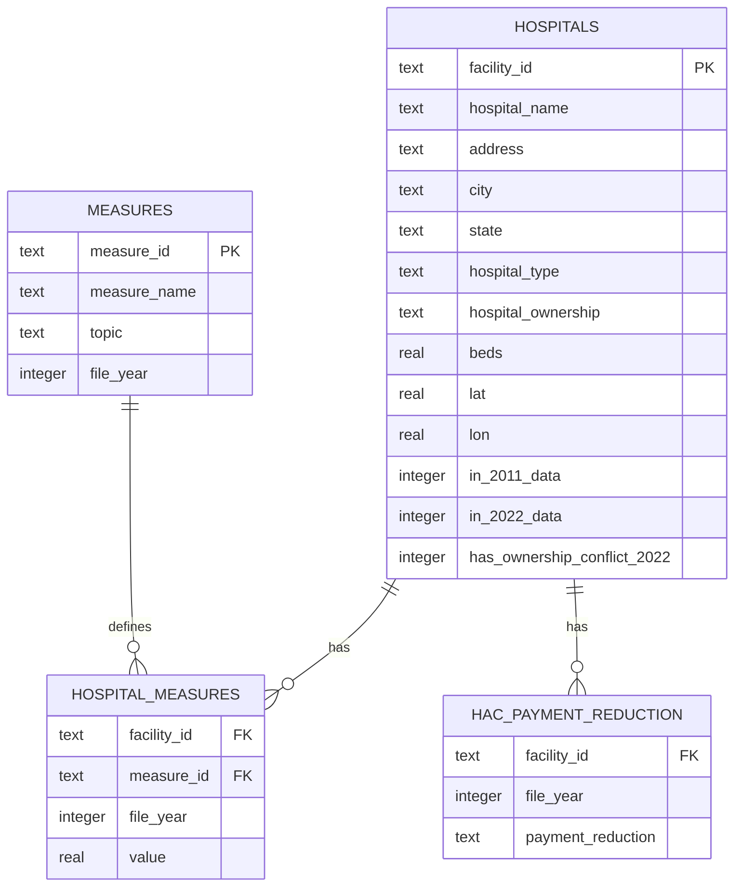

# Hospital Compare: Cleaning & Analyzing 8 Real CMS Public Health Files

An end-to-end SQL project: **8 raw, messy CMS files spanning two eras** (2011
and 2022) → cleaned, reconciled, and unified into one normalized relational
database → analytical SQL demonstrating CTEs, window functions, self-joins
across eras, and cross-topic joins.

**Source data:** [CMS Hospital Compare / Care Compare](https://data.cms.gov/provider-data/topics/hospitals) —
official U.S. government data on ~5,200 Medicare-certified hospitals, covering
mortality, infections, readmissions, cost, timeliness of care, and Medicare
payment penalties.

## Why 8 files instead of 1

Real analytics work rarely hands you one clean table — it hands you several
files from different systems, different years, and different conventions
that all *should* join together but don't quite, out of the box. This project
combines:

| Era | File | Topic |
|---|---|---|
| 2011 | `hospital-data.csv` | Hospital directory (address, ownership, type) |
| 2011 | `outcome-of-care-measures.csv` | AMI / heart failure / pneumonia mortality & readmission |
| 2022 | `Complications_and_Deaths_2022.csv` | 30-day mortality (AMI, CABG, COPD, stroke, heart failure) |
| 2022 | `HAIs_2022.csv` | Healthcare-associated infections (CLABSI, CAUTI, MRSA, C.diff, SSI) |
| 2022 | `Hospital_Readmissions_Reduction_Program_2022.csv` | 30-day excess readmission ratios |
| 2022 | `Payment_and_Value_of_Care_2022.csv` | Medicare payment per episode |
| 2022 | `Timely_and_Effective_Care_2022.csv` | Sepsis bundles, ED wait times, vaccination rates |
| 2022 | `Hospital_Acquired_Conditions_Reduction_Program_2022.csv` | HAC penalty program (Z-scores + Yes/No payment reduction) |

## The mess, specifically

- Two **different missing-value conventions** across eras: the 2011 file uses
  the sentinel string `"Not Available"`; the 2022 files just leave the cell
  blank. Both had to be reconciled to a real SQL `NULL`.
- The 2022 `Hospital` column mashes name and ID together —
  `"SOUTHEAST HEALTH MEDICAL CENTER (010001)"` — needing a regex split before
  any file could be joined to another.
- All 6 2022 files **repeat the same dimension columns** (ownership, beds,
  lat/lon...) for every hospital. Rather than assuming they agree, the ETL
  script actually checks for conflicts across files (see
  `has_ownership_conflict_2022` and query 07).
- A naive first pass at generating measure IDs collapsed genuinely different
  sub-measures into the same ID (e.g. a "Denominator" and a "Payment" column
  both got named `PAYMENT_FOR_HEART_ATTACK_PATIENTS`) and only surfaced as a
  primary-key collision on database load — a good example of a silent bug
  that only shows up once I try to actually use the data.
- Facility IDs only **partially overlap** between 2011 and 2022 — hospitals
  close, merge, and open over an 11-year gap, so the merge is an outer join,
  tagged with `in_2011_data` / `in_2022_data` flags.

Full breakdown with the fix for every issue: [`docs/data_cleaning_notes.md`](docs/data_cleaning_notes.md).

## Schema



**One fact table spans all 8 source files and both eras** — this is the
whole point of the normalization. Every measure, from every topic, from
every year, lives in `hospital_measures` keyed by `(facility_id, measure_id)`,
with the `measures` dimension carrying which of the 6 topics and which year
each measure came from. That's what makes queries like "compare 2011 vs 2022
mortality for the same hospital" (query 02) or "do HAC-penalized hospitals
have worse infection rates" (query 06) a single join instead of a bespoke
multi-table query for every pair of topics.

## Project structure

```
├── data/
│   ├── raw/
│   │   ├── hospital-data.csv                  # 2011 directory
│   │   ├── outcome-of-care-measures.csv       # 2011 outcomes
│   │   └── topics/                            # 6 current (2022) topic files
│   └── clean/                                 # cleaned, tidy CSVs (also loaded into the DB)
├── scripts/
│   └── clean_and_load.py                      # the ETL: reads 8 raw files → cleans → builds SQLite DB
├── sql/
│   ├── schema.sql                             # DDL for the normalized schema
│   └── queries/                               # 8 analytical queries, each documenting what it demonstrates
├── docs/
│   └── data_cleaning_notes.md                 # all 10 data-quality issues found, and how each was fixed
├── hospital_compare.db                        # the built SQLite database (generated by the script)
├── Query_01-08.ipynb                          # a seris of SQL exercises using SQLite and Jupyter Notebook
└── README.md
```

## How to run it

```bash
pip install pandas
python3 scripts/clean_and_load.py     # rebuilds hospital_compare.db from all 8 raw files
```

Then query the database with any SQLite client, e.g.:

```bash
python3 -c "
import sqlite3
conn = sqlite3.connect('hospital_compare.db')
print(conn.execute(open('sql/queries/06_hac_penalty_vs_infections.sql').read()).fetchall())
"
```

The schema in `sql/schema.sql` is plain ANSI-ish SQL and ports to PostgreSQL
with no changes beyond removing the SQLite-specific `PRAGMA` line.

**Note on the database file:** `hospital_compare.db` is ~115MB (423K fact
rows with composite text keys) and is `.gitignore`'d rather than committed —
regenerate it locally with the command above after cloning. It's included in
this delivered copy so you can query it immediately without running the
script first.

## Analytical queries

| Query | What it shows | SQL concepts |
|---|---|---|
| [`01_state_mortality_rankings_2022.sql`](sql/queries/01_state_mortality_rankings_2022.sql) | Ranks states by current AMI mortality vs. national average | CTE, `RANK()`, `HAVING` |
| [`02_then_vs_now_2011_2022.sql`](sql/queries/02_then_vs_now_2011_2022.sql) | Same hospital's AMI mortality, 2011 vs 2022 | Self-join **across eras** on the unified fact table |
| [`03_cross_topic_worst_quartile.sql`](sql/queries/03_cross_topic_worst_quartile.sql) | Hospitals in the worst quartile on BOTH an infection measure and a mortality measure | Two independent `NTILE()` CTEs joined on facility |
| [`04_ownership_vs_outcomes.sql`](sql/queries/04_ownership_vs_outcomes.sql) | Mortality across ownership types, 4 conditions side by side | Conditional aggregation (pivot pattern) |
| [`05_data_completeness_by_topic.sql`](sql/queries/05_data_completeness_by_topic.sql) | % missing per topic, not just per measure | Grouped data-quality audit |
| [`06_hac_penalty_vs_infections.sql`](sql/queries/06_hac_penalty_vs_infections.sql) | Do HAC-penalized hospitals really have worse infection rates? | Join a small categorical dimension into the main fact table |
| [`07_cross_file_consistency_check.sql`](sql/queries/07_cross_file_consistency_check.sql) | Do the 6 files agree on hospital ownership for the same facility? | Auditable SQL reproduction of an ETL-time QA check |
| [`08_topic_coverage_by_state.sql`](sql/queries/08_topic_coverage_by_state.sql) | Which states' hospitals report the most complete data? | Two-level aggregation (per-hospital → per-state) |

## Key findings

- **HAC payment-reduction penalties track real infection performance**:
  hospitals hit with a Medicare payment reduction under the HAC program
  average a CLABSI SIR of 1.29 vs. 1.06 for non-penalized hospitals, and
  similarly worse CAUTI and MRSA ratios (query 06) — the penalty program
  appears to be measuring something real, not noise.
- **Mortality rates mostly rose slightly** for hospitals present in both the
  2011 and 2022 data (query 02) — though this reflects both real changes in
  care/case-mix over 11 years and a switch in the underlying methodology
  CMS uses, not necessarily "care got worse."
- **Timely & Effective Care has the most missing data** of any 2022 topic
  (44.7% of cells), because many of its 30 measures (sepsis bundles, ED wait
  times) only apply to hospitals with the relevant service lines — a flat
  "% complete" number without this context would be misleading.
- **The 6 2022 topic files agree with each other** on hospital ownership for
  every one of ~3,000+ hospitals checked (query 07) — a genuinely useful
  negative result: it means the CMS Provider Data Catalog's underlying
  hospital dimension is internally consistent, which isn't guaranteed and is
  worth confirming rather than assuming.
- Of 5,237 total unique hospitals across both eras, only 4,826 appear in
  *both* the 2011 and 2022 snapshots — a reminder that hospital closures,
  mergers, and openings mean any "then vs. now" comparison is implicitly
  conditioned on hospitals that survived the whole period.

## Data source & license

Data originates from CMS (Centers for Medicare & Medicaid Services), a public
U.S. government agency; the underlying data is public domain. The 2011 files
are a static snapshot mirrored on GitHub
([donnemartin/hospital-quality](https://github.com/donnemartin/hospital-quality)).
The 2022 topic files come from a curated historical archive
([klocey/hospitals-data-archive](https://github.com/klocey/hospitals-data-archive))
of CMS's own releases. For current data, pull fresh files from
[data.cms.gov/provider-data](https://data.cms.gov/provider-data/topics/hospitals).
